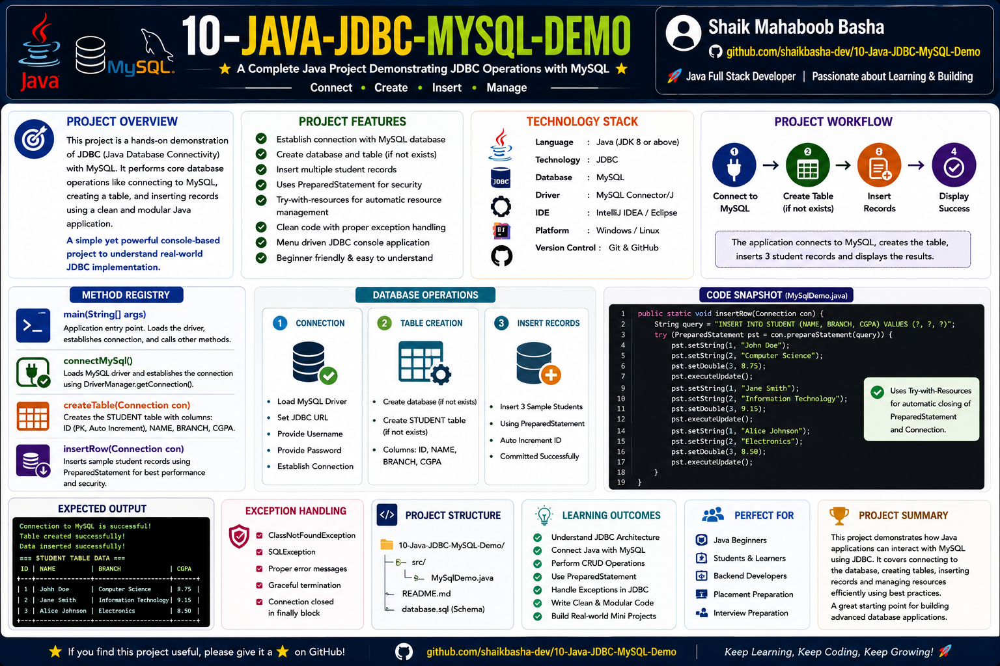

# Java JDBC MySQL Demo Project

## Project Overview

This project demonstrates how a **Java application connects to a MySQL database using JDBC (Java Database Connectivity)** and performs fundamental database operations.

The application provides a hands-on demonstration of JDBC by establishing a database connection, executing SQL statements, creating database tables, and inserting records into MySQL.

The project separates database operations into dedicated Java methods to maintain a simple, structured, and understandable program flow.

The project demonstrates:

* Java and MySQL database connectivity
* JDBC API usage
* Database connection management
* SQL statement execution
* Dynamic table creation
* Record insertion
* Try-with-resources
* Automatic resource management
* JDBC exception handling
* Structured method-based implementation

This project is designed as a beginner-friendly JDBC demonstration for understanding real-world Java database connectivity.

## Project Overview Infographic



## Project Features

This project provides:

* Establishing a connection with a MySQL database
* Executing SQL queries through JDBC
* Creating database tables dynamically
* Inserting records into database tables
* Using the JDBC Connection interface
* Using the JDBC Statement interface
* Managing database resources with try-with-resources
* Automatic closing of JDBC resources
* Structured database operations using separate methods
* JDBC exception handling
* Console-based execution
* Beginner-friendly implementation

## Technologies Used

* Java
* JDBC API
* MySQL
* SQL
* MySQL Connector/J
* Git
* GitHub

## Project Workflow

The application follows the following database interaction workflow:

1. Start the Java application
2. Execute the main() method
3. Call the JDBC database operation methods
4. Configure the database URL, username, and password
5. Establish a connection with MySQL
6. Create a JDBC Statement object
7. Execute the required SQL query
8. Perform the database operation
9. Display the operation result
10. Automatically close JDBC resources

The basic JDBC workflow can be represented as:

```text
Java Application
        |
        v
     JDBC API
        |
        v
  DriverManager
        |
        v
   JDBC Driver
        |
        v
 MySQL Database
```

## Method Registry and Technical Specifications

The project separates JDBC database operations into dedicated Java methods.

| Method Name | Access Scope | Input Parameters | Core Responsibility |
|---|---|---|---|
| `main` | `public static` | `String[] args` | Acts as the application entry point and controls the execution flow |
| `connectMySql` | `public static` | None | Establishes the MySQL connection and performs the configured SQL operation |
| `createTable` | `public static` | None | Executes a DDL query to create a database table |
| `insertRow` | `public static` | None | Executes an INSERT query to add a record to the database |

## 01 - Main Method

The `main()` method acts as the entry point of the Java application.

Responsibilities:

* Starts program execution
* Controls the application flow
* Calls JDBC operation methods
* Coordinates database operations

Example execution flow:

```text
main()
   |
   +-- connectMySql()
   |
   +-- createTable()
   |
   +-- insertRow()
```

## 02 - MySQL Database Connection

The `connectMySql()` method demonstrates how Java communicates with a MySQL database through JDBC.

The method performs the following operations:

* Defines the JDBC URL
* Defines the database username
* Defines the database password
* Establishes the database connection
* Creates a Statement object
* Executes the configured SQL query
* Displays the operation result

Important JDBC components used:

* DriverManager
* Connection
* Statement
* executeUpdate()

The connection is established using:

```java
DriverManager.getConnection(url, user, password)
```

## 03 - Creating a Database Table

The `createTable()` method demonstrates how to execute a **DDL (Data Definition Language)** command using JDBC.

The method creates a database table using a SQL `CREATE TABLE` statement.

Example table structure:

| Column | Data Type | Purpose |
|---|---|---|
| `id` | `INT` | Stores numeric identifiers |
| `name` | `VARCHAR(10)` | Stores text values with a maximum length of 10 characters |

Example SQL structure:

```sql
CREATE TABLE trainers (
    id INT,
    name VARCHAR(10)
);
```

The SQL command is executed through JDBC using:

```java
executeUpdate()
```

## 04 - Inserting a Database Record

The `insertRow()` method demonstrates how to insert a row into a MySQL database table.

The method:

* Establishes the database connection
* Creates a JDBC Statement
* Executes an INSERT query
* Retrieves the affected row count
* Displays the insertion result

Example SQL operation:

```sql
INSERT INTO trainers VALUES (1, 'DEEP');
```

The number of affected rows is returned by:

```java
executeUpdate()
```

## Automatic Resource Management Using Try-With-Resources

The project uses Java's **try-with-resources** feature for JDBC resource management.

Example structure:

```java
try (
    Connection con = DriverManager.getConnection(url, user, password);
    Statement st = con.createStatement()
) {
    // JDBC database operations
}
```

Resources declared inside the try-with-resources statement are automatically closed when the block finishes.

This approach helps:

* Reduce manual resource management
* Prevent JDBC resource leaks
* Automatically close database connections
* Automatically close Statement objects
* Improve code readability
* Follow modern Java resource management practices

## JDBC Components Used

### DriverManager

`DriverManager` is used to establish a connection between the Java application and the database.

```java
DriverManager.getConnection(url, user, password)
```

### Connection

The `Connection` interface represents an active connection with the MySQL database.

It is used to:

* Communicate with the database
* Create Statement objects
* Execute database operations

### Statement

The `Statement` interface is used to execute static SQL queries.

In this project, it is used for:

* INSERT operations
* CREATE TABLE operations

### executeUpdate()

The `executeUpdate()` method is used to execute SQL statements that modify the database.

It is commonly used with:

* INSERT
* UPDATE
* DELETE
* CREATE TABLE

For DML operations, the method returns the number of affected rows.

## Complete Program Pseudocode

```text
START

    CALL connectMySql()

    METHOD connectMySql()

        SET database URL
        SET database username
        SET database password

        SET SQL query

        OPEN database connection

        CREATE Statement object

        EXECUTE SQL update query

        PRINT updated row count

        PRINT connection success information

        CLOSE JDBC resources automatically

    END METHOD


    METHOD createTable()

        SET database credentials

        SET CREATE TABLE SQL query

        OPEN database connection

        CREATE Statement object

        EXECUTE CREATE TABLE query

        PRINT table creation success message

        CLOSE JDBC resources automatically

    END METHOD


    METHOD insertRow()

        SET database credentials

        SET INSERT SQL query

        OPEN database connection

        CREATE Statement object

        EXECUTE INSERT query

        PRINT inserted row count

        CLOSE JDBC resources automatically

    END METHOD

END
```

## Expected Output

### Output from connectMySql()

```text
Rows Updated: 1
Connection Successful: com.mysql.cj.jdbc.ConnectionImpl@2a139a55
```

The exact connection object identifier may vary between program executions.

### Output from createTable()

```text
Table created successfully
```

### Output from insertRow()

```text
Inserted rows : 1
```

## Exception Handling

JDBC applications may encounter database and connectivity-related exceptions.

### SQLException

`SQLException` may occur because of:

* Incorrect database credentials
* Invalid SQL queries
* Database access problems
* Missing tables
* Invalid database configuration

### SQLSyntaxErrorException

`SQLSyntaxErrorException` may occur when:

* SQL syntax is incorrect
* A table does not exist
* A column name is invalid
* Database objects are referenced incorrectly

### Communications Link Failure

A communication failure may occur when:

* MySQL Server is not running
* The JDBC URL is incorrect
* The database port is unavailable
* The database server cannot be reached

## Learning Outcomes

After understanding this project, learners can:

* Understand the basic JDBC architecture
* Connect Java applications with MySQL
* Use DriverManager to establish database connections
* Work with the Connection interface
* Create JDBC Statement objects
* Execute SQL commands from Java
* Create database tables through JDBC
* Insert records into MySQL
* Use executeUpdate()
* Manage JDBC resources using try-with-resources
* Understand common JDBC exceptions
* Organize database operations into separate methods

## Project Highlights

* Hands-on JDBC demonstration project
* Java and MySQL database connectivity
* Structured method-based implementation
* Dynamic table creation
* SQL record insertion
* JDBC Statement usage
* Try-with-resources implementation
* Automatic JDBC resource management
* Exception handling concepts
* Beginner-friendly console application
* Suitable for JDBC practice and revision

## Who Can Use This Project

This project is useful for:

* Java beginners
* JDBC beginners
* Java Full Stack Developer aspirants
* Backend development learners
* College students
* Freshers preparing for technical interviews
* Placement preparation
* Developers revising JDBC fundamentals

## Author

**Shaik Mahaboob Basha**

B.Tech - Electronics and Communication Engineering

Aspiring Java Full Stack Developer

## Future Improvements

The project may be extended with:

* PreparedStatement
* Complete CRUD Operations
* SELECT Query and ResultSet
* UPDATE Operation
* DELETE Operation
* Batch Processing
* JDBC Transactions
* Commit and Rollback
* Savepoints
* DAO Design Pattern
* Connection Pooling
* DataSource
* User Input
* Menu-Driven Console Application

## Support

If this repository helps you in your learning journey, interview preparation, or future reference, please consider giving it a **Star ⭐**. Your support is greatly appreciated and motivates me to continue creating high-quality educational repositories.

## Conclusion

This project demonstrates the fundamental interaction between a Java application and a MySQL database using JDBC. It covers database connectivity, SQL execution, table creation, record insertion, JDBC interfaces, automatic resource management, and exception scenarios through a structured method-based implementation.

The project provides a practical foundation for understanding Java database programming and can be extended into more advanced JDBC, backend development, and Java Full Stack applications.

Happy Learning and Keep Coding!
